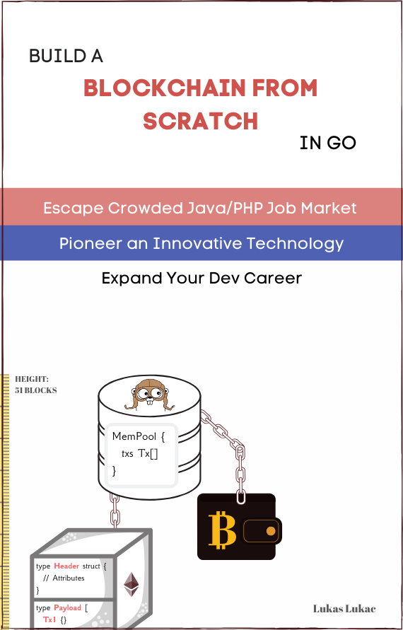
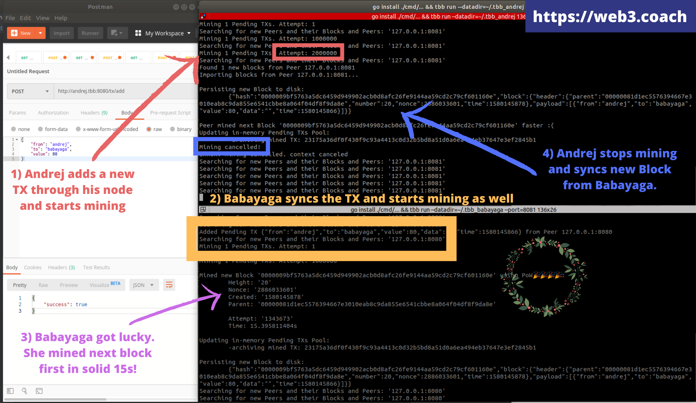
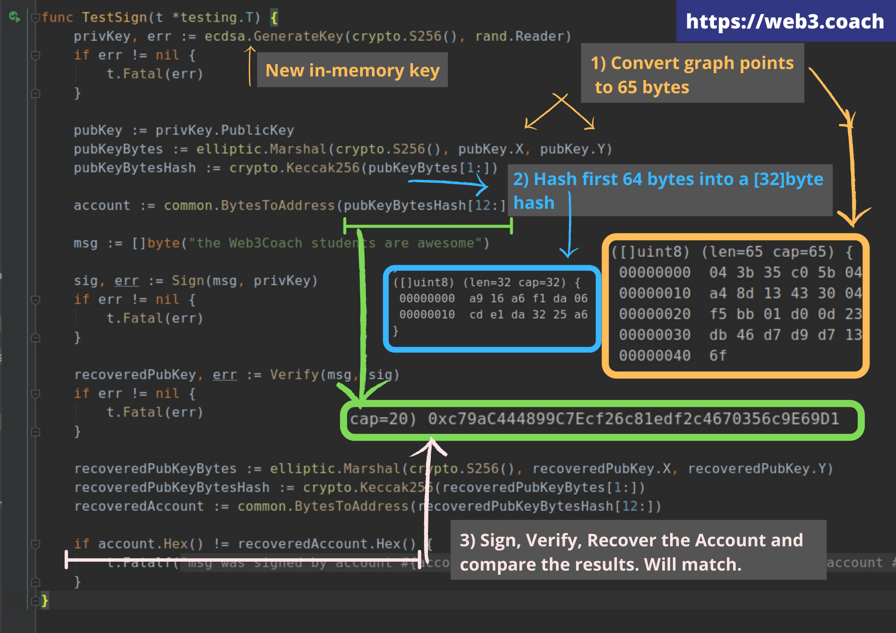

# The Blockchain Bar

> The source-code for: "Build a Blockchain from Scratch in Go" eBook.

:books: Get the eBook from: [https://gumroad.com/l/build-a-blockchain-from-scratch-in-go](https://gumroad.com/l/build-a-blockchain-from-scratch-in-go)

[](https://web3.coach#book)

Table of Contents
=================

- [TBB Training Ledger](#tbb-training-ledger)
    * [What will you build?](#what-will-you-build-)
        + [1) You will build a peer-to-peer system from scratch](#1--you-will-build-a-peer-to-peer-system-from-scratch)
        + [2) You will secure the system with a day-to-day practical cryptography](#2--you-will-secure-the-system-with-a-day-to-day-practical-cryptography)
        + [3) You will implement Bitcoin, Ethereum and XRP backend components](#3--you-will-implement-bitcoin--ethereum-and-xrp-backend-components)
        + [4) You will write unit tests and integration tests for all core components](#4--you-will-write-unit-tests-and-integration-tests-for-all-core-components)
    * [How to use this repository](#how-to-use-this-repository)
    * [Installation](#installation)
    * [Getting started](#getting-started)
- [Usage](#usage)
    * [Install](#install)
    * [Install with Docker](#install-with-docker)
    * [CLI](#cli)
        + [Show available commands and flags](#show-available-commands-and-flags)
        + [Create a blockchain wallet account](#create-a-blockchain-wallet-account)
        + [Run a TBB node connected to the official book's test network](#run-a-tbb-node-connected-to-the-official-book-s-test-network)
        + [Or run a TBB bootstrap node in isolation (only on your machine)](#or-run-a-tbb-bootstrap-node-in-isolation--only-on-your-machine-)
    * [Test Network](#test-network)
    * [Tests](#tests)
- [Start](#start)
    * [Tutorial](#tutorial)
- [Finish](#finish)
    * [Request 1000 TBB testing tokens](#request-1000-tbb-testing-tokens)
- [Disclaimer](#disclaimer)
- [License](#license)

# TBB Training Ledger
Hi! :wave:

My name is Lukas. Nice to meet you, and welcome to the peer-to-peer world.

Is blockchain just an over-engineered database and a monetary mess? No. Every blockchain component and its architecture design decision has a technical reason enabling the decentralized, open, verifiable, transparent vision of Web3.

I am working in Web3 full-time since 2018. Do you know what was my biggest struggle? **Understanding HOW blockchains work internally and WHY do we need components like Transaction, Block, Mempool, Consensus, Sync and Wallet** in the first place. Reading low-level technical Yellow Papers is a noble, but honestly, a difficult starting point. The goal of this book is to introduce software developers to blockchain via a story - follow how a software developer, who is looking to revolutionize his local bar, implements blockchain technology for its payment system.

Enjoy the eBook.

## What will you build?

Chapter by chapter, you will build a full peer-to-peer, autonomous training blockchain system in Go and **learn all standard blockchain components!**

### 1) You will build a peer-to-peer system from scratch

You start with 0 lines of code and end-up with 16 branches and a completely executable blockchain node.

PS: Don't worry if anything on the screen makes sense yet, it will once you go chapter by chapter; release by release.


### 2) You will secure the system with a day-to-day practical cryptography

No boring theory. Only modern practices.


### 3) You will implement Bitcoin, Ethereum and XRP backend components 

From diagrams of mining algorithms to actual, implemented and working crypto wallets for storing the mined tokens and all other fundamental components that make blockchain special.



### 4) You will write unit tests and integration tests for all core components

You will test your cryptographic functions, a Bitcoin's like Proof of Work mining algorithm and other key components.



## How to use this repository
Every eBook chapter has a dedicated branch where you can experiment with the code first-hand.

```git
git pull --all
git branch

> c1_genesis_json
> c2_db_changes_txt
> c3_state_blockchain_component
> c4_caesar_transfer
> c5_broken_trust
> c6_immutable_hash
> c7_blockchain_programming_model
> c8_transparent_db
> c9_tango
> c10_peer_sync
> c11_consensus
> c12_crypto
> c13_training_network
> c14_why_transaction_costs_gas
> c15_blockchain_forks_what_why_how
> c16_blockchain_explorer
```

## Installation

[Open full instructions.](./Installation.md)

## Getting started
1. Buy the eBook from: [https://gumroad.com/l/build-a-blockchain-from-scratch-in-go](https://gumroad.com/l/build-a-blockchain-from-scratch-in-go)
1. Open the book at Chapter 1
1. Checkout the first chapter's branch `c1_genesis_json`

```git
git pull --all

git checkout c1_genesis_json
```

# Usage

## Install
```
go install ./cmd/...
```

## Install with Docker

[Open Docker instructions.](./Docker.md)

## CLI
### Show available commands and flags
```bash
tbb help

tbb run --help

Launches the TBB node and its HTTP API.

Usage:
  tbb run [flags]

Flags:
      --bootstrap-account string   default bootstrap Web3Coach's Genesis account with 1M TBB tokens (default "0x09ee50f2f37fcba1845de6fe5c762e83e65e755c")
      --bootstrap-ip string        default bootstrap Web3Coach's server to interconnect peers (default "node.tbb.web3.coach")
      --bootstrap-port uint        default bootstrap Web3Coach's server port to interconnect peers (default 443)
      --datadir string             Absolute path to your node's data dir where the DB will be/is stored
      --disable-ssl                should the HTTP API SSL certificate be disabled? (default false)
  -h, --help                       help for run
      --ip string                  your node's public IP to communication with other peers (default "127.0.0.1")
      --miner string               your node's miner account to receive the block rewards (default "0x0000000000000000000000000000000000000000")
      --port uint                  your node's public HTTP port for communication with other peers (configurable if SSL is disabled) (default 443)
```

### Create a blockchain wallet account
```
tbb wallet new-account --datadir=$HOME/.tbb

> Please enter a password to encrypt the new wallet:
> Password:
```

### Run a TBB node connected to the official book's test network

```
tbb version
> Version: 1.9.2-alpha  TX Gas

tbb run --datadir=$HOME/.tbb --ip=127.0.0.1 --port=8081 --miner=0x_YOUR_WALLET_ACCOUNT --disable-ssl
```

Your blockchain database will synchronize with rest of the students:

```json
Launching TBB node and its HTTP API...
Listening on: 127.0.0.1:8081
Blockchain state:
- height: 0
- hash: 0000000000000000000000000000000000000000000000000000000000000000
Searching for new Peers and their Blocks and Peers: 'node.tbb.web3.coach:443'
Found 37 new blocks from Peer node.tbb.web3.coach:443
Importing blocks from Peer node.tbb.web3.coach:443...

Persisting new Block to disk:
{"hash":"000000a9d18730c133869d175a886d576df5675e0e73900bf072c59047b9d734","block":{"header":{"parent":"0000000000000000000000000000000000000000000000000000000000000000","number":0,"nonce":1925346453,"time":1590684713,"miner":"0x09ee50f2f37fcba1845de6fe5c762e83e65e755c"},"payload":[{"from":"0x09ee50f2f37fcba1845de6fe5c762e83e65e755c","to":"0x22ba1f80452e6220c7cc6ea2d1e3eeddac5f694a","value":5,"nonce":1,"data":"","time":1590684702,"signature":"0JE1yEoA3gwIiTj5ayanUZfo5ZnN7kHIRQPOw8/OZIRYWjbvbMA7vWdPgoqxnhFGiTH7FIbjCQJ25fQlvMvmPwA="}]}}

Persisting new Block to disk:
{"hash":"0000004d3faa1f7b8802aa809c8b77253859846602de3402a1bc67a0026cd94d","block":{"header":{"parent":"000000a9d18730c133869d175a886d576df5675e0e73900bf072c59047b9d734","number":1,"nonce":1331825342,"time":1592320406,"miner":"0x09ee50f2f37fcba1845de6fe5c762e83e65e755c"},"payload":[{"from":"0x09ee50f2f37fcba1845de6fe5c762e83e65e755c","to":"0x596b0709ed646e3e76b6c1fd58297b145b68387c","value":1000,"nonce":2,"data":"","time":1592320398,"signature":"1JIi9sYEZ+9RBG7IwACmm9vC4D7QVXqvBH1Es7cmeCJljTknVM80AzrhoLAW9RwCguunRO0qpN4JJ287VLFNfAE="}]}}
...
```

### Or run a TBB bootstrap node in isolation (only on your machine)
```
tbb run --datadir=$HOME/.tbb_boostrap --ip=127.0.0.1 --port=8080 --bootstrap-ip=127.0.0.1 --bootstrap-port=8080 --disable-ssl
```

## Test Network
You can also set up a server and be part of TBB blockchain network validating other student's transactions. Here is an example how the official TBB bootstrap node is launched. Customize the `--datadir`, `--miner`, and `--ip` values to match your server.

```bash
/usr/local/bin/tbb run --datadir=/home/ec2-user/.tbb --miner=0x09ee50f2f37fcba1845de6fe5c762e83e65e755c --ip=node.tbb.web3.coach --port=443 --ssl-email=lukas@web3.coach --bootstrap-ip=node.tbb.web3.coach --bootstrap-port=443 --bootstrap-account=0x09ee50f2f37fcba1845de6fe5c762e83e65e755c
```

## Tests
Run all tests with verbosity but one at a time, without timeout, to avoid ports collisions:
```
go test -v -p=1 -timeout=0 ./...
```

Run an individual test:
```
go test -timeout=0 ./node -test.v -test.run ^TestNode_Mining$
```

**Note:** Majority are integration tests and take time. Expect the test suite to finish in ~30 mins.

# Start
## Tutorial

:books: Get the eBook from: [https://gumroad.com/l/build-a-blockchain-from-scratch-in-go](https://gumroad.com/l/build-a-blockchain-from-scratch-in-go) 

# Finish
## Request 1000 TBB testing tokens

Write a tweet and let me know how did you like this book! Tag me in it [@Web3Coach](https://twitter.com/Web3Coach) and include your account address 0xYOUR_ADDRESS. I will send you 1000 testing TBB tokens.

See you on Twitter - [@Web3Coach.](https://twitter.com/Web3Coach)

Or LinkedIn - [LukasLukac](https://www.linkedin.com/in/llukac/)

---

# Disclaimer
The Blockchain Bar repository, the `tbb` binary and `Build a Blockchain from Scratch in Go` eBook is **for learning, educational purposes.** The codebase is NOT ready for production. The components are purposefully simplified to don't overwhelm new blockchain students, but complex enough to teach you how blockchains work under the hood.

# License
The Blockchain Bar library (i.e. all code outside of the `cmd` directory) is licensed under the
[GNU Lesser General Public License v3.0](https://www.gnu.org/licenses/lgpl-3.0.en.html),
also included in our repository in the `COPYING.LESSER` file.

The Blockchain Bar binaries (i.e. all code inside of the `cmd` directory) is licensed under the
[GNU General Public License v3.0](https://www.gnu.org/licenses/gpl-3.0.en.html), also
included in our repository in the `COPYING` file.
